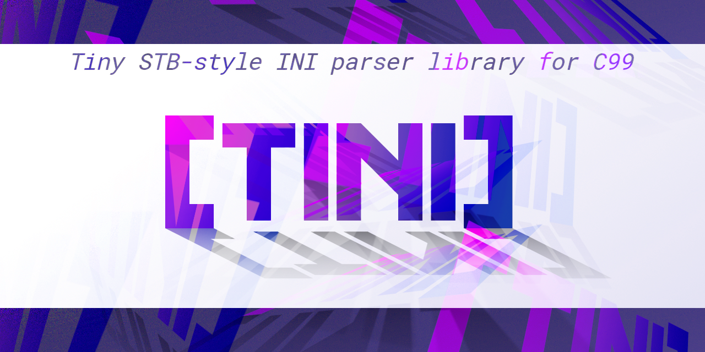

	
	 
	
	
	
	
	
	 
	<h1>tini</h1>
	
Tiny STB-style INI parser library for C99

	

		<a href="#documentation">Documentation</a>
		·
		<a href="https://github.com/LordOfTrident/tini/issues">Report Bug</a>
		·
		<a href="https://github.com/LordOfTrident/tini/issues">Request Feature</a>
	

	
Table of contents

	<ul>
		<li><a href="#introduction">Introduction</a></li>
		<li><a href="#example">Example</a></li>
		<li><a href="#documentation">Documentation</a></li>
		<li><a href="#bugs">Bugs</a></li>
	</ul>

## Introduction
**tini** is a tiny INI parser library for C99 in the style of [STB](https://github.com/nothings/stb),
which means it's contained within a single header file.

## Example
See the [example program](./example.c). To compile it, run `make`.

## Documentation
The documentation is in a comment at the top of the [library file](./tini.h). To use the library,
simply copy the file into your project and include it.

## Bugs
If you find any bugs, please, [create an issue and report them](https://github.com/LordOfTrident/tini/issues).

 

	
	 
	
	

(<a href="#readme-top">Back to top</a>)

